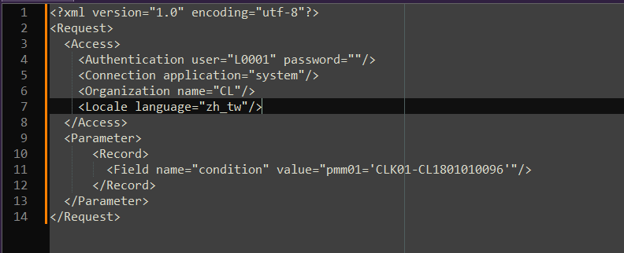
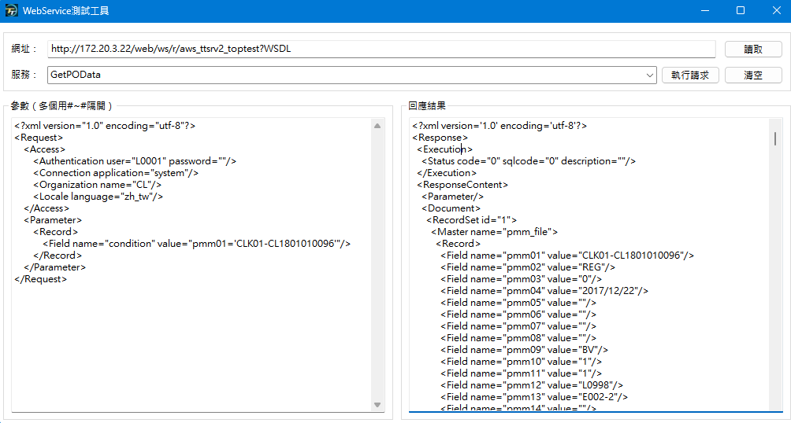
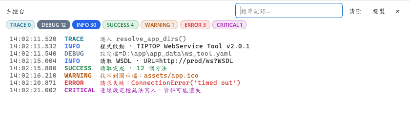

# 專案簡介

WebService服務部署到了服務器，但是只能本地訪問，下載soapui有點太大了，找其他的測試工具又沒有合適的，就自己寫了個比較簡單的小工具！

* Python 3.14
* PySide6（Essentials）6.11
* loguru 0.7
* suds 1.2
* lxml 6.1
* PyYAML 6.0
* PyInstaller 6.22

## 開發說明
1. 安裝依賴：`$ uv sync`
2. 啟動程式：`$ uv run python src/ws_tool.py`
3. 執行測試：`$ uv run test`（等同 `uv run pytest`，額外參數會原樣傳入；會在 `reports/test-report.html` 產生可用瀏覽器開啟的測試報告）
4. 語法檢查：`$ uv run lint`（對 `src`、`tests`、`plugins` 執行 ruff check）
5. UI 檢測工具（類似瀏覽器的「檢查元素」）：`$ uv run python -m PyQtInspect --direct --file src/ws_tool.py`
6. 打包 exe：`$ uv run build`，完成後會在 `dist` 目錄產生 `WebService-Tool.exe`；會自動把 `src/app_data/ws_tool.yaml` 複製到 `dist/app_data/ws_tool.yaml`（每次 build 都會覆蓋，確保與 repo 一致）。`connections.profile` 不會自動產生或複製，程式首次啟動時會自動建立空白的一份；若要沿用既有連線資料，散布時自行把 `connections.profile` 放進同一個 `dist/app_data/` 目錄
   `uv run build` 會一併產生 `dist/plugins/settings_editor/`（設定編輯器外掛，含 pyqtgraph、numpy）；散布時放在 exe 同層即可使用 F11 設定頁，不附上則 F11 顯示「未安裝」。升級 pyqtgraph／numpy 時同步修改 `pyproject.toml` 的 dev 群組與 `plugins/settings_editor/build_plugin.py` 的版本，並執行 `uv run python plugins/settings_editor/gen_host_imports.py` 重新產生 `host_imports.txt`
7. 封裝發行版本：`$ uv run package`（先執行 build，再依 `ws_tool.yaml` 的 `app.version` 把 `dist` 壓縮成 `WebService-Tool-vX.Y.Z.zip`）
8. 清除打包產物：`$ uv run clean`（清空 `dist` 目錄底下所有檔案，保留目錄本身）；`$ uv run clean-package`（先 clean 再完整跑一次 build + package）
9. 暫時不支持mac環境打包，如果有想法也可以自己去找到合適的配套方案

## Task 指令一覽（`uv run <指令>`）

`pyproject.toml` 的 `[project.scripts]` 把常用工作流程包成指令，對應 `tasks/` 底下的模組：

| 指令 | 對應模組 | 說明 |
|---|---|---|
| `uv run test` | `tasks/test.py` | 轉呼叫 `pytest`；額外參數原樣傳入，並產生 `reports/test-report.html` 測試報告 |
| `uv run lint` | `tasks/lint.py` | 對 `src`、`tests`、`plugins` 執行 `ruff check` |
| `uv run build` | `tasks/build.py` | 用 PyInstaller 建置 `WebService-Tool.exe`，一併建置設定編輯器外掛並複製 `ws_tool.yaml` 到 `dist` |
| `uv run package` | `tasks/package.py` | 先執行 `build`，再依 `app.version` 把 `dist` 壓縮成發行用的 zip |
| `uv run clean` | `tasks/clean.py` | 清空 `dist` 目錄底下的檔案（執行前會先關閉正在跑的 exe） |
| `uv run clean-package` | `tasks/clean_package.py` | 先 `clean` 再完整跑一次 `build` + `package` |

## 介面
* 左側為連線清單（可搜尋、新增、刪除），可用目錄分組：拖曳或右鍵「移動到」把連線放進目錄、拖曳調整順序，右鍵「重新命名」修改目錄名稱
* 左下角「主題」可切換 跟隨系統 / 淺色 / 深色；「主控台」可開關右側下方的即時記錄面板（見下方說明）
* 快捷鍵：F1 新增連線、F2 刪除選取的連線或目錄、F3 讀取 WSDL、F5 執行、F6 清空、Ctrl+Shift+F 格式化請求、F11 工具參數設定（再按一次或 Esc 返回）、Ctrl+\` 開關主控台、Esc 離開
* 按 F11 以樹狀表單編輯 app_data/ws_tool.yaml；名稱、版本、版權、圖示、逾時儲存後立即生效，log 與連線設定需重新啟動

### 主控台（即時記錄面板）

* 按左下角「主控台」按鈕或 `Ctrl+\``，在右側工作區下方開關可拖曳調整高度的記錄面板；工作區與 F11 設定頁共用同一個面板
* 即時顯示程式從啟動、讀取 WSDL、執行請求到關閉期間的記錄，開啟面板前的記錄也會補顯示
* 依 TRACE／DEBUG／INFO／SUCCESS／WARNING／ERROR／CRITICAL 七個等級篩選，每顆按鈕標示目前筆數，即使該等級被隱藏也看得出有幾筆；預設顯示 DEBUG、INFO、SUCCESS
* 可輸入關鍵字搜尋（不分大小寫），並提供清除、複製目前顯示內容
* 開關狀態、面板高度、篩選的等級會存到 `settings.ini`，下次啟動沿用；不影響 `app_data/logs/run.log` 本身的記錄等級（仍依 `ws_tool.yaml` 的 `app.log.level` 設定）

### 記錄檔

所有記錄檔都放在 `ws_tool.yaml` 的 `app.log.path`（預設 `app_data/logs`），每天自動歸檔為 `名稱_YYYYMMDD.log`，超過保留天數的歸檔會自動刪除。

| 檔案 | 內容 | 相關設定 |
| --- | --- | --- |
| `run.log` | `app.log.level` 以上的所有記錄 | `level`、`retention` |
| `ws_info.log`／`ws_debug.log`／`ws_error.log` | 只收該等級 | `levels`、`retention` |
| `ws_other.log` | TRACE、SUCCESS、WARNING、CRITICAL | `levels`、`retention` |
| `ws_xml.log` | 每次執行請求的參數＋回應（或 SOAP 信封） | `xml.enabled`、`xml.content`、`xml.retention` |

按 **F10** 或側欄的紀錄按鈕開啟「請求紀錄」視窗，可依日期、連線、方法與關鍵字查詢，並把某一筆帶回工作區重新執行。

## 版本產生
切到 src/config 底下輸入
`python grab_version.py C:\Windows\System32\WWAHost.exe`  
系統自動產生 file_version_info.txt 用於包裝到pyinstaller的版本檔案使用

## 內置功能

1. 測試WebService接口（支持多參數，不支持添加請求頭）
2. 主控台即時記錄查看：等級篩選、關鍵字搜尋，執行過程中的請求與例外一目了然，不必再另外開 log 檔

## 下載體驗

- 下載檔案：[WebService.exe](<https://github.com/m121752332/webservice-py-tool/releases>)

## 演示效果

<table>
    <tr>
        <td><label>收集請求資料內容</label></td>
    </tr>
    <tr>
        <td></td>
    </tr>
    <tr>
        <td><label>執行請求參數取得回應資料</label></td>
    </tr>
    <tr>
        <td></td>
    </tr>
    <tr>
        <td><label>主控台記錄面板</label></td>
    </tr>
    <tr>
        <td></td>
    </tr>
</table>
